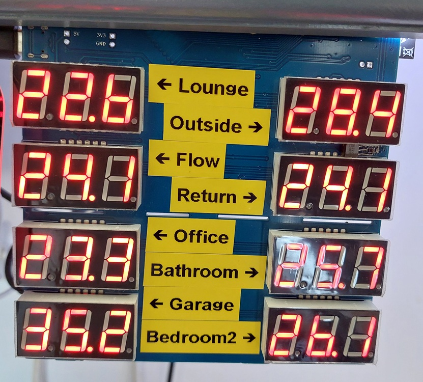
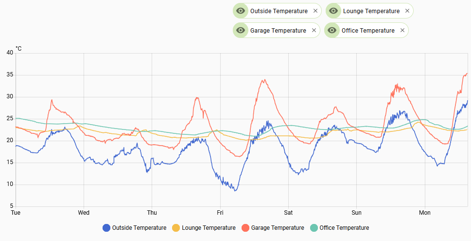

# wireless-thermometer-display-esp32
ESP32-based temperature display with HTTPS web server support designed for RESTful



Loosely based on the [Simple HTTP File Server Example](https://github.com/espressif/esp-idf/blob/master/examples/protocols/http_server/file_serving/README.md) but with various code changes to improve the reliability of the wifi connection and to generate the dynamic JSON data with the current temperatures.

The PCB is the same one used in (octopus-unit-rate-display)[https://github.com/deveon95/octopus-unit-rate-display].

The PCB has 8 displays but you can have as many temperatures as you like on the web server. The default is 16.

Decoding of the Manchester protocol is not yet implemented in the ESP32. One day this might be done using the Remote Control Transceiver. In the meantime, an NKM2401 needs to be soldered onto the PCB's prototyping area to convert the 433MHz receiver's output to UART which is connected to the ESP32. The NKM2401 is a pre-programmed PIC12F508 and its firmware can be downloaded from [here](https://picaxe.com/downloads/nkm2401.hex.txt).

# Setup

This project requires the ESP-IDF framework to be installed. Once done, a few simple commands from the ESP-IDF Command Line are required to configure the project.

Use idf.py menuconfig to open up the configuration tool. Go down to 'Example Connection Configuration' in the list, press Enter, then enter your WiFI connection parameters, then press Q to quit.

Connect the PCB to the computer and use Device Manager to check which COM port has been assigned to it. Run idf.py build flash monitor -p COMx to build and flash the project, and to open a serial terminal. This will allow you to easily see whether the WiFi connection was successful and what IP address has been assigned.

If the build is successful and the WiFi configuration is correct, the board should connect to your access point. Open your router configuration and set the device to use a static IP address.

Once the ESP32 is up and running, a `temperatures.json` file will appear at whichever IP address is assigned to the board.

## Example `temperatures.json`

```yaml
[
  {
    "temperature": "22.6"
  },
  {
    "temperature": "28.9"
  },
  {
    "temperature": "24.4"
  },
  {
    "temperature": "24.5"
  },
  {
    "temperature": "23.5"
  },
  {
    "temperature": "25.9"
  },
  {
    "temperature": "35.6"
  },
  {
    "temperature": "26.9"
  },
  {
    "temperature": "unknown"
  },
  {
    "temperature": "unknown"
  },
  {
    "temperature": "21.9"
  },
  {
    "temperature": "unknown"
  },
  {
    "temperature": "unknown"
  },
  {
    "temperature": "unknown"
  },
  {
    "temperature": "unknown"
  },
  {
    "temperature": "unknown"
  }
]
```

## Example configuration for RESTful integration in Home Assistant (goes in `configuration.yaml`)

Remember to replace the IP address in the example with the one from your network.

```yaml
# ESP32 temperature display - scan every 5 minutes
rest:
  - scan_interval: 300
    resource: http://192.168.4.12/temperatures.json
    sensor:
      - name: "Lounge Temperature"
        unique_id: temp1001
        value_template: "{{ value_json.0.temperature }}"
        unit_of_measurement: "°C"
      - name: "Outside Temperature"
        unique_id: temp1002
        value_template: "{{ value_json.1.temperature }}"
        unit_of_measurement: "°C"
      - name: "Flow Temperature"
        unique_id: temp1003
        value_template: "{{ value_json.2.temperature }}"
        unit_of_measurement: "°C"
      - name: "Return Temperature"
        unique_id: temp1004
        value_template: "{{ value_json.3.temperature }}"
        unit_of_measurement: "°C"
      - name: "Office Temperature"
        unique_id: temp1005
        value_template: "{{ value_json.4.temperature }}"
        unit_of_measurement: "°C"
      - name: "Bathroom Temperature"
        unique_id: temp1006
        value_template: "{{ value_json.5.temperature }}"
        unit_of_measurement: "°C"
      - name: "Garage Temperature"
        unique_id: temp1007
        value_template: "{{ value_json.6.temperature }}"
        unit_of_measurement: "°C"
      - name: "Bedroom2 Temperature"
        unique_id: temp1008
        value_template: "{{ value_json.7.temperature }}"
        unit_of_measurement: "°C"
      - name: "Spare Temperature 1"
        unique_id: temp1009
        value_template: "{{ value_json.8.temperature }}"
        unit_of_measurement: "°C"
      - name: "Spare Temperature 2"
        unique_id: temp1010
        value_template: "{{ value_json.9.temperature }}"
        unit_of_measurement: "°C"
      - name: "Spare Temperature 3"
        unique_id: temp1011
        value_template: "{{ value_json.10.temperature }}"
        unit_of_measurement: "°C"
      - name: "Spare Temperature 4"
        unique_id: temp1012
        value_template: "{{ value_json.11.temperature }}"
        unit_of_measurement: "°C"
      - name: "Spare Temperature 5"
        unique_id: temp1013
        value_template: "{{ value_json.12.temperature }}"
        unit_of_measurement: "°C"
      - name: "Spare Temperature 6"
        unique_id: temp1014
        value_template: "{{ value_json.13.temperature }}"
        unit_of_measurement: "°C"
      - name: "Spare Temperature 7"
        unique_id: temp1015
        value_template: "{{ value_json.14.temperature }}"
        unit_of_measurement: "°C"
      - name: "Spare Temperature 8"
        unique_id: temp1016
        value_template: "{{ value_json.15.temperature }}"
        unit_of_measurement: "°C"
```

## Example temperature history in Home Assistant

